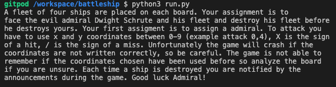
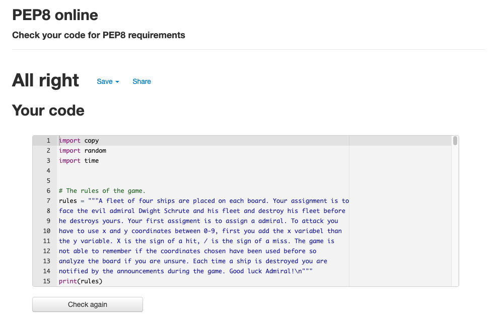

# Battleship Game
The battleship game is a traditional battleship game where a player is able to face an AI opponent. Basically a fun game perfect for passing time.

# Features

## Rules 

In the beggining of the game the rules are presented.

## Username

A player is able to choose what their admirals name is.

## Announcements 

Announcements surrounding the game are put forth before and after each shot during the game. 

* It notifys the player if the shot was a hit or a miss.
* if a ship was destroyed. 
* If you lost or won. 

## Storing hits and misses

The board stores hits and misses. 

## AI opponent

The opponent is a AI. 
* The AI shots at the board at random. 
* The AI shots 3 secounds after the human players turn, it's not a necessity but it's there to try to resemble how a human plays the game.

# Future features

* Enable placement of ships in fleet by the player. As of now only the admin can change the positions of the ships, unfortunatly this means that the player will likely realise that the fleet is positioned the same way after a couple of games.

* Developing a AI opponent which is more effecient than simply putting out random coordinates on the game board.

* If previousley used coordinates are put forth again the game should notify the player and enable them to choose new coordinates instead of continuing.

# Testing

## Manual Testing

* Check if instructions are displayed correctly.
* Check if a players can choose a username.
* Check if faulty coordinates work (Faulty numbers, letters or signs), they don'y (only numbers between 0-9 are accepted).
* Check if commenting is correct and a player can add cordinates again until it's correct.
* Check if game board is displayed as intended.
* Check if a miss or hit is displayed correctly on the game board.
* Check if commenting matches a hit or miss.
* Check if the game ends when a player has won or lost.
* Check if commenting matches a win or loss.

## Python

Went through [PEP8](http://pep8online.com//) without issues.

# Unfixed Bugs

* The game has no way of knowing if the coordinates have been used before or not.

* If a player writes down the coordinates before the AI has attacked the player might get confused since the input seems to be needed to be put forth again. If it is the player has to put forth the coordinates again. Can be avoided through removing the time module. Will keep for more realistic user experience.

# Deployment
Deployment on Heroku.
1. After login click New button in the right top corner.
2. Chose app-name and region.
3. Choose settings in the bar.
4. Click reveal Config Vars and add Key Port and the Value 8000.
5. Add the buildpack heroku/python and heroku/nodejs in this order.
6. Click on Deploy in the bar.
7. Click on connect on github in the Deployment method section.
8. Click search in the connect to GitHUb section and choose the relevant github repository.
9. Click on Automatic deploys or manual deploy depending on preference. Manual deploy was chosen for this      project.

 Here is a link to the finished game [Battleship Game](https://battleship-s.herokuapp.com/).

# Credits

The code for the battleship game was in part acquired through a tutorial series on [Youtube](https://www.youtube.com/watch?v=Gi0Fdyhk1_0&t=9s), [Youtube](https://www.youtube.com/watch?v=tCHHAdzVGaI), [Youtube](https://www.youtube.com/watch?v=j4YyoYOCnK8&t=10s), [Youtube](https://www.youtube.com/watch?v=OftI6gq038U), [Youtube](https://www.youtube.com/watch?v=ZEEhMEEc8Ns), [Youtube](https://www.youtube.com/watch?v=089ZSEILbBM), [Youtube](https://www.youtube.com/watch?v=Pcy5X1GdbyQ).

# Acknowledgements 

[Code Institute](https://codeinstitute.net) for providing excellent course material and tutoring.
